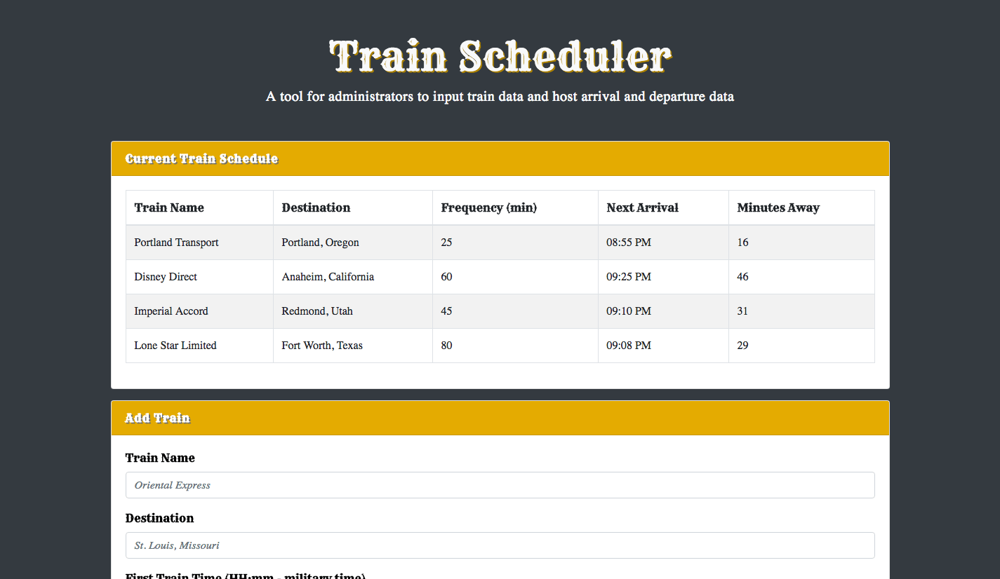

# Train Scheduler

This train schedule application allows administrators to input train data and incorporates Firebase to host arrival and departure data.

#### Overview:
* The application retrieves and manipulates this information with Moment.js.
* It provides up-to-date information about various trains, including their arrival times and how many minutes remain until each train arrives at it station.

#

#### > __Click Below to Try it Out:__

